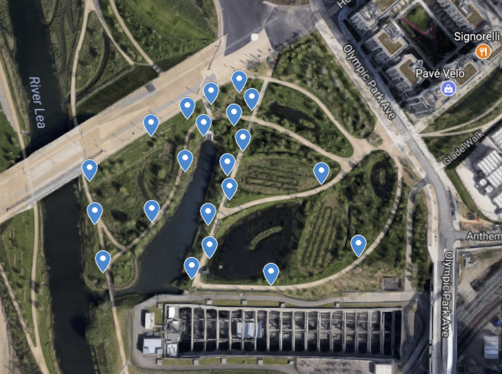
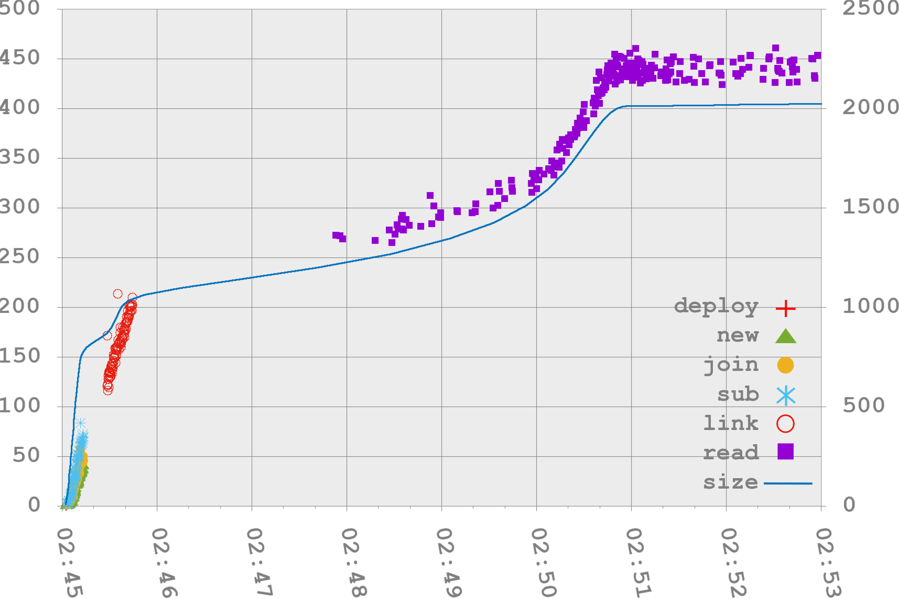

# ICECCS 2018
This repository provides data and code used for the evaluation of a modelling and verification framework for large-scale wireless sensor network (WSN) infrastructures published in a paper titled "[Modelling and Verification of Large-Scale Sensor Network Infrastructures](http://eprints.gla.ac.uk/169407/)" [1] at the 23rd International Conference on Engineering of Complex Computer Systems ([ICECCS 2018](http://formal-analysis.com/iceccs/2018/)). The approach is based on the bigraphs formalism and the [BigraphER](http://www.dcs.gla.ac.uk/~michele/bigrapher.html) engine [2] for rewriting and analysis for
bigraphs.

## Data

### Input dataset
The folder provides a dataset ([input_dataset/ENO_Box_3B06.csv](https://github.com/mkabac/iceccs-2018/blob/master/data/input_dataset/ENO_Box_3B06.csv)) collected from a microclimate WSN deployment in the Queen Elizabeth Olympic Park (QEOP) over the period of two months [2] as depicted in the figure below. 

<br />
<p align="center">
    
    <h5 id="title" align="center">An overview of the microclimate WSN deployment in QEOP.</h5>
</br>

Nodes in the deployed WSN collected data from multiple sensors (e.g. temperature, humidity, light Level,	atmospheric pressure) and provided also data on the their internal state (e.g. consumed energy, generated energy, battery state, etc.)) as well as a timestamp indicating the occurrence of sensing.

### Evaluation results

The results of the performance evaluation for our tool can be found in the ```evaluation_results``` folder. The evaluation has been done over simulated WSNs at different scales ranging from 10 to 200 nodes. The processing time for both updating configurations of the WSN infrastructure model and the verification of static properties can be found in CSV files (one CSV file for each WSN). We focused on updates that correspond directly to the different events of interest in the infrastructure: each update involves many rewrite steps as well as the verification of predicates.

The processing time for an event of interest (e.g. new node in the WSN) is the third value right after the timestamp of the event. For example, the new node event for one of the nodes in the WSN at the scale of 200 nodes (i.e. [events_200_nodes.csv](https://github.com/mkabac/iceccs-2018/blob/master/data/evaluation_results/events_200_nodes.csv)) was processed by our framework in ```2.741098 ms``` as shown below.

```
new node,12:33:58.433,2.741098,106,15
```

The relation between the size of the bigraph model and the execution time of reaction rules is depicted in the figure below for the experiment carried out over a WSN with 100 nodes.

<br />
<p align="center">
    
    <h5 id="title" align="center">Performance evaluation for WSN with 100 nodes. [x] execution time (hh:mm), [left y] event processing time (ms), [right y] model size (bigraph entities).</h5>
</br>

## Model

The model of the WSN infrastructure used for the evaluation of our approach can be found in the ```model``` folder. The model is available in two versions. The ```model.big``` file defines the model using the bigraph specification language (more information on the model specification language can be found [here](http://www.dcs.gla.ac.uk/~michele/bigrapher.html)). The ```model.ml``` file defines the same model using an OCaml library (the library documentation can be found [here](http://www.dcs.gla.ac.uk/~michele/docs/bigraph/index.html)).

## References
[1]Sevegnani, M. , Kabac, M., Calder, M.  and McCann, J. A. (2018) Modelling and Verification of Large-Scale Sensor Network Infrastructures. In: 23rd International Conference on Engineering of Complex Computer Systems (ICECCS 2018), Melbourne, Australia, 12-14 Dec 2018, (Accepted for Publication)

[2] Sevegnani, M.  and Calder, M.  (2016) BigraphER: rewriting and analysis engine for bigraphs. In: CAV 2016: 28th International Conference on Computer Aided Verification, Toronto, Canada, 17-23 Jul 2016, pp. 494-501.

[3] G. Jackson, S. Gallacher, D. Wilson, and J. A. McCann, “Tales from the wild: Lessons learned from creating a living lab,” in International Workshop on the Engineering of Reliable, Robust, and Secure Embedded Wireless Sensing Systems (FAILSAFE’17). ACM, 2017.
